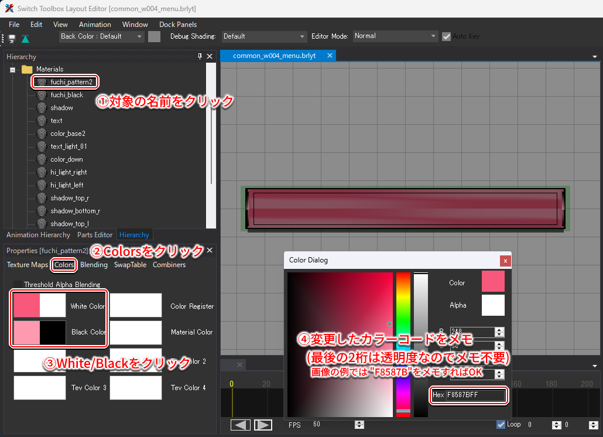

# BetterRecolorをリリースしました
最終更新日: 2026年4月3日

## Intro / はじめに
ボタンとテキストのカラーを変更する作業って、めちゃくちゃ大変です。
経験者でもすべてのファイルを変更するのは骨が折れる作業だと思います。手作業なら反映ミスも起きやすいので、修正を含めると自分は3～4時間くらいかけていました。
初心者の方にとっては、どのファイルを変更すればいいのかもわからないと思います。

BetterRecolorは、この問題を解決するために開発されたツールです。
[https://github.com/8MeTools/BetterRecolor](https://github.com/8MeTools/BetterRecolor)

## BetterRecolorとは
ゲーム内で表示されるボタンやテキストの色を一括で編集できるツールです。Pythonで開発されており、Google Colabでもローカル環境でも使用できます。

特にColabを利用すると、次のような恩恵を受けることができます。

1. **実行環境に依存しない**  
    
    クラウド上の割り当てられたマシンで処理を実行するため、個人のPC環境に左右されません。
2. **環境構築不要**  

    ブラウザ上でコードを実行できるため、Pythonのインストールやライブラリのセットアップが不要です。

ゆえに、プログラミングの知識がない方でも、簡単にボタンとテキストのカラーを変更することができます。

ゲームの内部ファイルの構造や、プログラミングの知識を必要としません。
これは、多くの人にとって大きなメリットになると思います。

## Usage / 使い方
ここに書くと長くなりすぎるので、リポジトリのREADMEを参照してください。英語版も日本語版も用意しているので、どちらか好きな方を見ていただければと思います。
- [English](https://github.com/8MeTools/BetterRecolor/blob/main/README.md)
- [日本語](https://github.com/8MeTools/BetterRecolor/blob/main/README_JP.md)

## Tips / 豆知識
`color_config.json`の`white`や`black`は、[Switch Toolbox](https://github.com/KillzXGaming/Switch-Toolbox)で確認できるものと共通です。そのため、Switch Toolboxで色を確認してから、`color_config.json`に反映させるといった使い方をすると便利です。

| Pane Name       | File Name                                        | 
| --------------- | ------------------------------------------------ | 
| `fuchi_pattern2 (fuchi_pattern)`  | `./button/blyt/common_w004_menu.brlyt`             | 
| `color_base2 (color_base)`     | `./button/blyt/common_w004_menu.brlyt`             | 
| `color_yajirushi` | `./button/blyt/common_w016_yajirushi_left.brlyt`   | 
| `ability_graph2 (ability_graph)`  | `./control/blyt/common_w099_machine_ability.brlyt` | 
| `black_pt00 (black_parts_t_00)`      | `./control/blyt/common_w027_chara_name.brlyt`      | 

上記のPaneは、`MenuSingle.szs`のサブファイルに存在します。
> バニラのファイルで探す場合は、括弧の中に記述したPane Nameを探してください。

File Nameは、MenuSingle.szsのサブファイルのパスを示しています。
Switch Toolboxを使用してMenuSingle.szsを開き、上記のPaneが存在するサブファイルを探してください。
サブファイルを開くと、ソフトウェア内でプレビューを確認できます。実際にPaneのカラーコードを編集して、ゲームで表示される色がどのように変化するかを確認することができます。

変更したいカラーコードを決定したら、`color_config.json`ファイルを編集してください。`color_config.json`には、変更したいカラーコードと対応するPaneの名前が記載されています。これを変更することで、同じPane Nameのカラーコードを一括で変更することができます。

JSONファイルの変更が完了したら、pythonスクリプト(もしくはipynb)を実行してください。