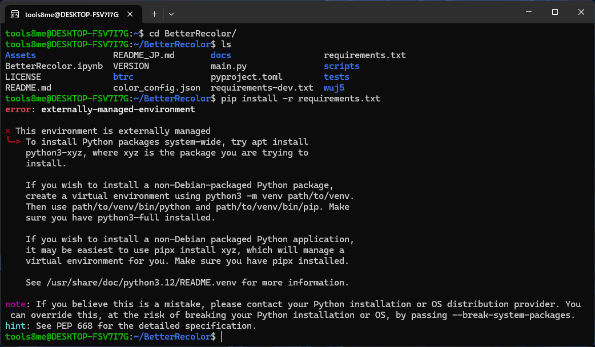
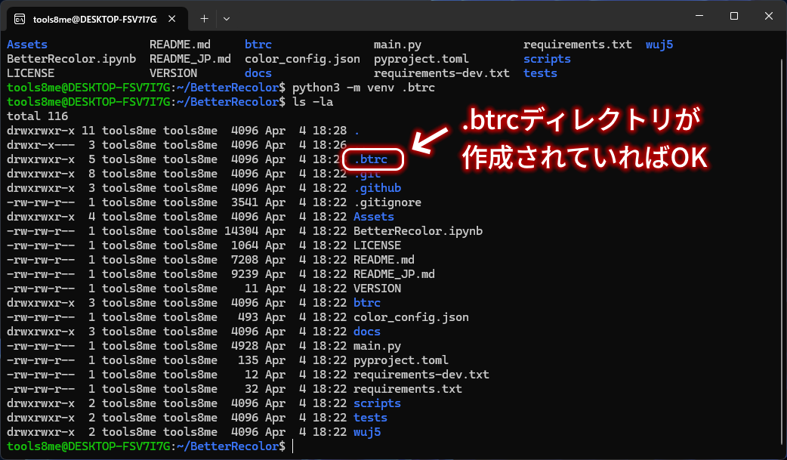
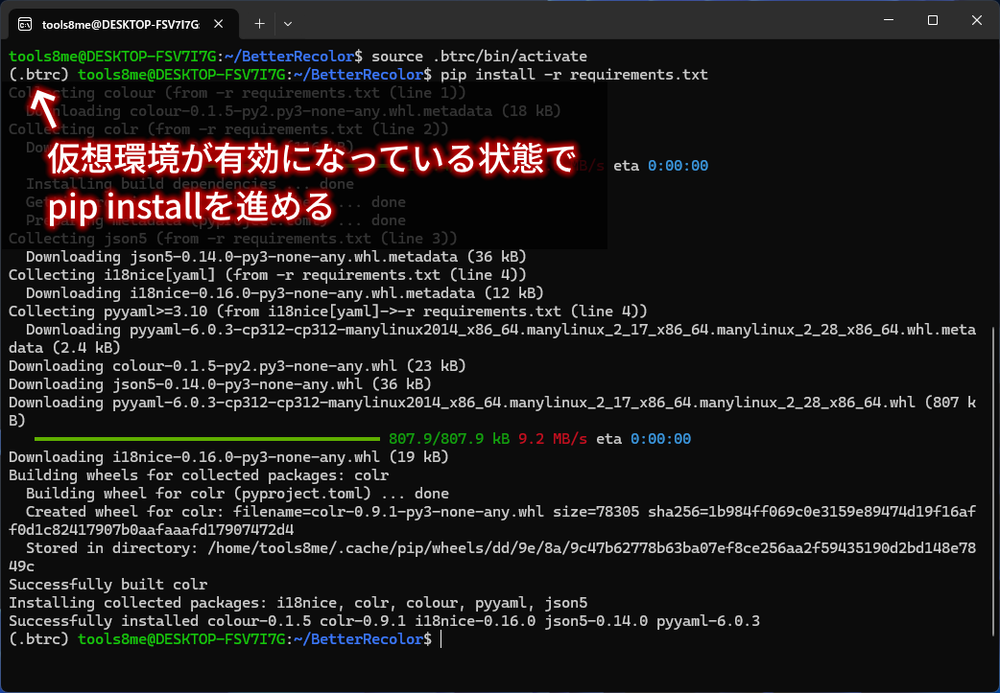
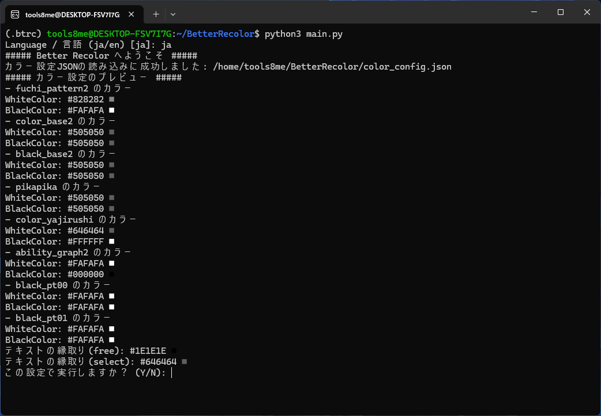
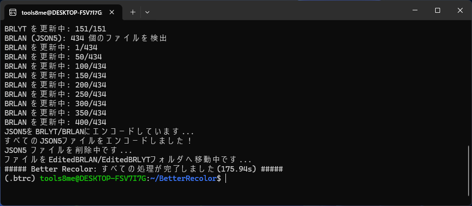
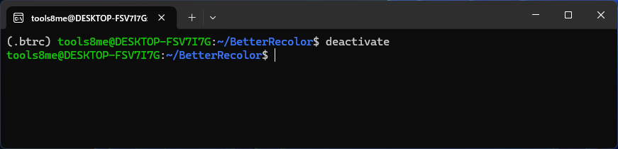

# BetterRecolorをWSL2で動かしてみる
最終更新日: 2026年4月4日

## Target audience / 対象読者
- WSL2を利用しており、WSL2でBetterRecolorを動かしたい方

> 基本的なLinuxの操作を理解していることを前提としています。WSL2のインストール方法やLinuxの基本的なコマンドなどは、他のリソースを参考にしてください。

## Intro / はじめに
BetterRecolorをWSL2で動かす方法を紹介します。
基本的にはWindowsやmacOSで動かす方法と同じですが、依存関係のインストール時にいくつか注意点があります。

手順通りに依存関係をインストールしようとすると、以下のようなエラーが出るはずです。



WSL2ではシステム全体にPythonパッケージをインストールすることを推奨していないためにこのエラーが出ています。
無視する方法などもありますが、プロジェクトごとに仮想環境を作成して、その中に必要なパッケージをインストールする方法が一般的です。

今回は、Pythonの仮想環境である`venv`を使用して、BetterRecolorの依存関係をインストールする方法を紹介します。

## Environment / 動作環境
以下の環境で動作を確認しています。
- Windows 11 Home 64-bit
- WSL2 (Ubuntu 24.04 LTS)
- Python 3.12.2

> WSL2をデフォルトの手順でインストールしている場合は、上記の環境が整っているはずです。

## Steps / 手順

以下のページを参考にして**Python, pip, venv をインストール**までを行ってください。
仮想環境の作成からこの記事で扱います。

[WSL2でPython,pip,venvをインストールして仮想環境を作成](https://zenn.dev/ak_yoshimatsu/articles/69457d3f44fe55)

> 以下は、すべて**WSL2のターミナル上で実行するコマンド**になります。PowerShellやコマンドプロンプトではないことに注意してください。

### 1. `git clone`でBetterRecolorのリポジトリをクローン
```bash
$ git clone https://github.com/8MeTools/BetterRecolor.git
```

### 2. クローンしたリポジトリのディレクトリに移動
`path/to/BetterRecolor`はクローンしたリポジトリのパスに置き換えてください。
```bash
$ cd path/to/BetterRecolor
```

### 3. 仮想環境を作成
```bash
$ python3 -m venv .btrc
```
上のコマンドを実行すると、BetterRecolorのディレクトリ内に`.btrc`という名前の仮想環境が作成されます。
隠しファイルになっているので、確認する際には以下のようにしてください。
```bash
$ ls -la
```

問題なく`.btrc`が作成されていることが確認できました。

### 4. 仮想環境を有効化
BetterRecolorのディレクトリ内で以下のコマンドを実行して、仮想環境を有効化してみます。以下のコマンドを実行してください。
```bash
$ source .btrc/bin/activate
```
仮想環境が有効化されると、ターミナルのプロンプトに`(.btrc)`と表示されるようになります。これは、現在`.btrc`という仮想環境がアクティブであることを示しています。
```bash
# 仮想環境が有効化された状態の表示
(.btrc) user@hostname:~/path/to/BetterRecolor$
```
仮想環境が有効になったので、pipを使用してBetterRecolorの依存関係をインストールしてみましょう。
```bash
$ pip install -r requirements.txt
```



先ほどのエラーが出ることなく、依存関係が正常にインストールされました。

これでBetterRecolorをWSL2上で動かすための環境が整いました。
あとは、BetterRecolorの使い方に従って、コマンドを実行してみてください。

ただし、実行する際には、仮想環境が有効になっている(ターミナルに`(.btrc)`と表示されている)ことを確認してください。

### 5. BetterRecolorを実行
仮想環境が有効になっている状態で、BetterRecolorを実行してみます。
```bash
$ python3 main.py
```

問題なくBetterRecolorが起動しました。


実行が終了した後の表示も問題ありませんでした。
> 自分の環境では180秒前後で処理が完了しましたが、環境によって処理時間は異なります。

### 6. 仮想環境を無効化
作業が終わったら、以下のコマンドで仮想環境を無効化することができます。
```bash
$ deactivate
```
仮想環境が無効化されると、ターミナルのプロンプトから`(.btrc)`が消えます。
```bash
# 仮想環境が無効化された状態の表示
user@hostname:~/path/to/BetterRecolor$
```


これでBetterRecolorの仮想環境を無効化することができました。

## Conclusion / おわりに
BetterRecolorをWSL2で動かす方法を紹介しました。
WSL2ではシステム全体にPythonパッケージをインストールすることが推奨されていないため、仮想環境を作成して、その中に必要なパッケージをインストールする方法が一般的です。

2回目以降は、仮想環境を有効化してからBetterRecolorを実行するだけでOKです。今回紹介した方法を参考にして、WSL2上でBetterRecolorを動作させてみてください。

それではまた。

## References / 参考文献
- [WSL2でPython,pip,venvをインストールして仮想環境を作成 (Zenn)](https://zenn.dev/ak_yoshimatsu/articles/69457d3f44fe55)